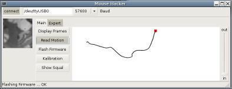

# ADNS 3080 Motion Sensor
We have developed a highly integrated, low-cost, angle sensitive motion sensor that does not exhibit slip effects.
This sensor is based on a commercial motion sensor that has been originally designed for applications in an optical computer mouse. Since these chips are mass produced the entire sensor becomes quite cheap.
By interfacing the mouse sensor with a microcontroller and an USB device, combined with well dimensioned optical assemblies, we successfully created a powerfull motion sensor easily adaptable for different applications. 

## Features
* Non slip speed over ground measurement
* Measurement of 2D velocity
* Absolute determination of position
* Low budget
* Measurement of yaw rate by combining two of the sensors
* Powerfull and easy to use software interface

## Paper
2010 IEEE Intelligent Vehicles Symposium, San Diego, California

[Low-Cost Sensors for Image based Measurement of 2D Velocity and Yaw Rate](./Paper.pdf)

## Missing sources
The Atmega implementation is based on 3rd party source code to communicate with the ADNS3080. I have no clue about the license, so i removed the code.
What you need to do to port the code is to implement the missing read/write_reg() and send/receieve() functions. Code for the Atmega should be around.
The required opcodes are also available, e.g. [here](https://github.com/shimniok/ADNS3080/blob/master/ADNS3080Demo/ADNS3080.h).

## Software
* avr_232.c: Atmega8A code to communicate with the PC library over serial and interface to ADNS3080
* MotionSensor: Library to interact with the Atmega via serial interface. Provides abstraction of all ADNS3080 functionalities.
* sensor_cfg: GTK integration of MotionSensor
* simple_demo.cpp: Simple integration of MotionSensor
* yrs: Yaw Rate Sensor combining two MotionSensors

## Original Source
<http://www.mrt.kit.edu/res2_2650.php>
